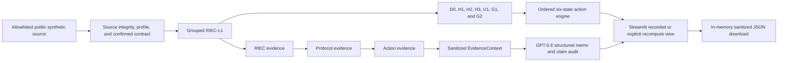

# RIEC Guard architecture

RIEC Guard is a public synthetic mechanism demo for auditable decisions from
conflicting evidence. Deterministic Python owns every statistical value, gate,
action state, pilot bound, and evidence identity. GPT-5.6 receives sanitized
aggregate facts and is limited to structured explanation and claim review.

## System map

The numerical path and GPT path meet only after the deterministic action and
aggregate evidence have been validated.

## 1. Source, profile, and contract boundary

The analytical services accept run-owned source bytes rather than arbitrary file
paths. Source identity and SHA-256 are checked before analysis. The deterministic
profiler produces typed counts, missingness, and bounded semantic hints without
publishing raw rows.

An `AuditContract` fixes the response, product, deployment-group, order, stream,
shift, unit, tail threshold, and policy settings. Decision-critical fields require
explicit confirmation before analysis is permitted. GPT may suggest an advisory
column-role mapping from a redacted profile, but it cannot confirm a contract or
enable analysis.

The Streamlit product narrows this further: it exposes only three committed public
synthetic scenarios and does not provide an arbitrary upload path.

## 2. Grouped RIEC-L1

The grouped selector evaluates the frozen M0–M6 candidate library. It uses exact
leave-one-deployment-group-out prediction, not random-row cross-validation. Each
candidate retains fit and prediction feasibility, full-fit `BIC_eff`, row-weighted
grouped predictive risk, baseline-relative `XPE`, and the combined `C_lambda`
score.

The result records the winner, runner-up, score gap, near-tie status, equivalence
set, and a bounded switching diagnostic. The candidate registry is versioned and
immutable; neither the UI nor GPT can add candidates or change the ranking.

## 3. Deterministic protocols and gates

The selected RIEC result feeds seven typed entries:

- D0: descriptive mean diagnostic;
- H1: empirical strict-tail headroom;
- H2: Gaussian residual-tail headroom;
- H3: Student-t residual-tail headroom;
- U1: whole-deployment-group bootstrap, conditional on the selected model;
- G1: ordered stability screen; and
- G2: evidence sufficiency gate.

Production defaults use 200 whole-group bootstrap replicates. Protocols remain
separate evidence objects: a parametric tail estimate, empirical boundary,
bootstrap bound, stability screen, and sufficiency gate are not collapsed into a
single invented score. A deterministic conflict summary preserves material
disagreement.

## 4. Six-state action engine

The pure state machine evaluates states in this fixed order:

1. `invalid_contract`;
2. `insufficient_evidence`;
3. `no_actionable_headroom`;
4. `diagnose_process_first`;
5. `pilot_only_conservative`; and
6. `pilot_range_supported`.

The first triggered state wins. Any displayed interval is a retrospective
screening reference that still requires a controlled pilot and engineering review;
it is not a production setpoint.

## 5. Evidence DAG

Aggregate evidence is content-addressed and run-owned. The public decision chain is
`RIEC -> PROTOCOL -> ACTION`: each item binds its source hashes, canonical content,
parents, and evidence ID. Cross-run rebinding and forged lifecycle completion are
rejected.

Recorded demo summaries preserve the same three-node chain. The UI verifies the
catalog, summary, CSV, policy, action, evidence IDs, parent links, and hashes before
projecting immutable display models. It never renders a complete internal canonical
object.

## 6. GPT-5.6 structured layer

The bounded workflow has three typed tasks:

1. advisory contract-role suggestion;
2. evidence-linked decision memo; and
3. claim audit.

The live adapter fixes the model to `gpt-5.6`, uses structured Pydantic outputs,
sets `store=false`, supplies no tools, and bounds retries and timeouts. Prompts are
versioned in code. Returned metadata binds task, mode, model, prompt version, input
hash, output hash, and response ID when present.

Before a memo is accepted, deterministic validators check its numbers, citations,
action semantics, limitations, and prohibited claims. The claim audit cannot weaken
a deterministic blocker. If narrative assistance fails, the deterministic audit
remains available.

## 7. Streamlit modes

The default recorded mode validates and displays committed production-default
results. It performs no statistical recomputation on import, page load, scenario
change, fixture generation, or download.

`Recompute deterministic audit` is the only recompute trigger. It runs one
allowlisted scenario through the accepted pipeline with 200 whole-group bootstrap
replicates and verifies the result against the committed record.

GPT also has two explicit modes:

- Fixture mode runs the complete typed workflow through a deterministic non-live
  client and requires no credential or network request.
- Live mode appears only when a server-side credential and strict enable flag are
  present. It additionally requires acknowledgement and an explicit click, and
  permits at most one successful run per scenario per session.

No client, analysis, or network operation is created during module import.

## 8. Privacy and threat boundaries

- GPT receives only an allowlisted `EvidenceContext` of aggregate facts and
  evidence IDs—never CSV contents, raw rows, residual arrays, row predictions,
  local paths, prompts, credentials, or hidden reasoning.
- The deployment credential is read server-side only at the explicit live action.
  It is not placed in session state, cache, disk, logs, errors, or downloads.
- Narrative and recompute results are scenario-scoped and session-local. Scenario
  changes clear prior narrative output.
- The download packet is deterministic JSON assembled in memory from an explicit
  allowlist. It contains no raw data or runtime trace.
- Unknown scenario identifiers and path-shaped input fail closed.
- Public and local industrial data boundaries remain separate; this repository
  contains only public synthetic demonstration data.

## 9. Why code owns the numbers

The action must be reproducible from a fixed contract, dataset identity, registry,
policy, and seed. Language-model output is probabilistic and therefore cannot own
tail estimates, grouped validation, evidence sufficiency, action ordering, or pilot
bounds. RIEC Guard computes and hashes those results first, then allows GPT-5.6 to
explain only verified facts and audit the wording against the same evidence.

## Scope

This release is retrospective screening software demonstrated on public synthetic
mechanisms. It does not establish causality, optimization, production safety,
compliance, achieved savings, or a production setpoint. External deployment and
live industrial validation remain human-controlled activities outside this local
release.
